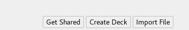
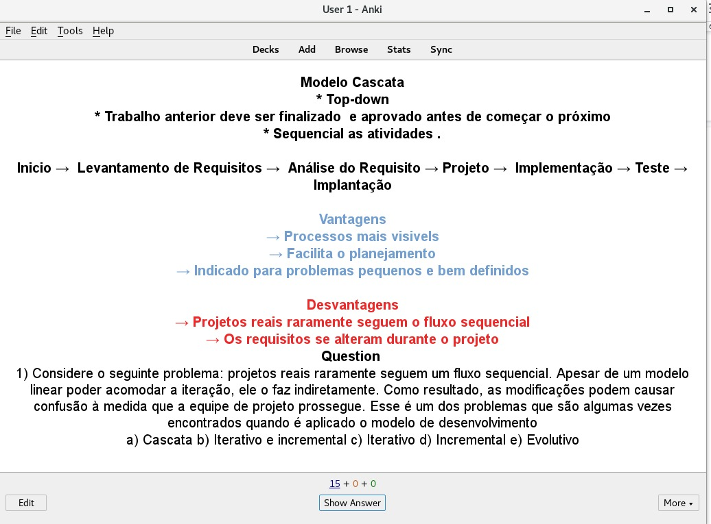

# Software Eng II 

## Slides 

## Anki deck , study to grades (P1, and P2)

Anki deck contains questions and thoery about.

#### Prova I 

Anki deck have  **76** cards with front and back!!!! 

* Modelos Cascata
* Modelo V
* Modelo Espiral
* Modelo incremental
* Modelo RAD
* Métodos  Ágeis ( Scrum/eXtreme Programming/FDD/ MSF/ DSDM/UP)
* Processos de Verificação e Validação 

 Download anki https://apps.ankiweb.net/ then you 

 

 import file from [here](/anki/Software Eng II (Deck - P1).apkg) 

Exemple questions:

 
 
